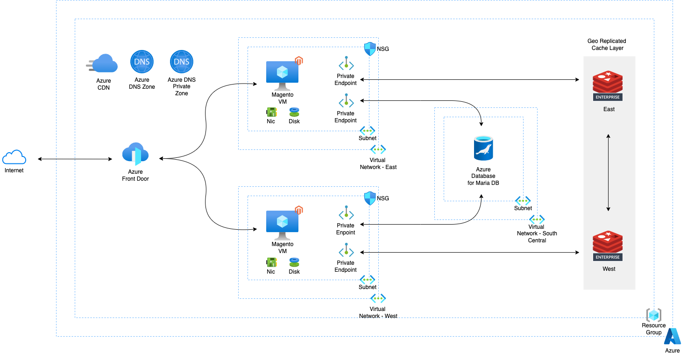
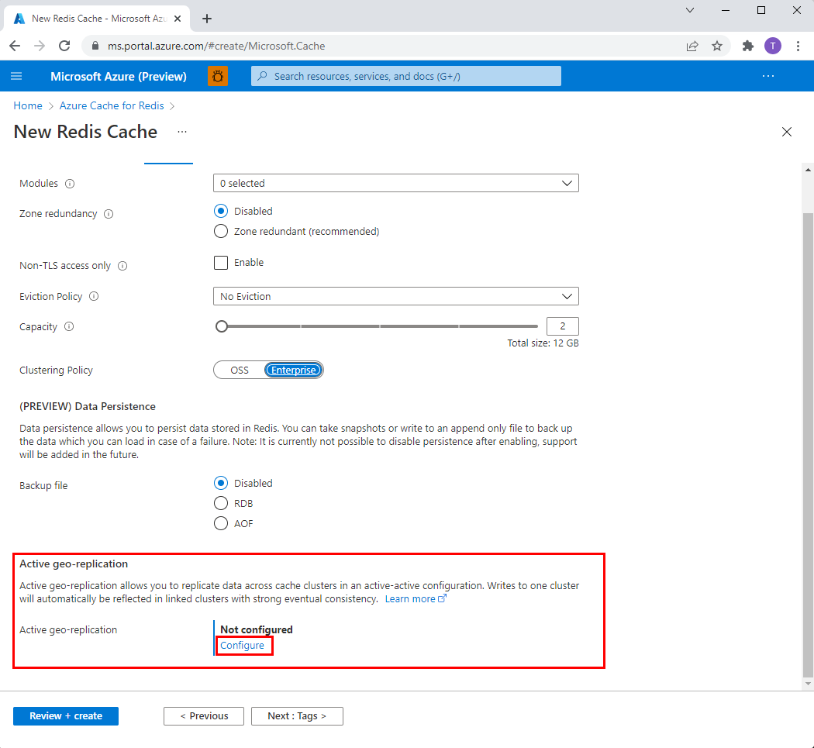
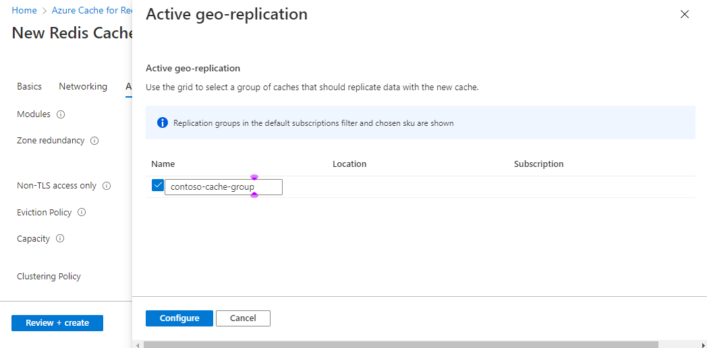
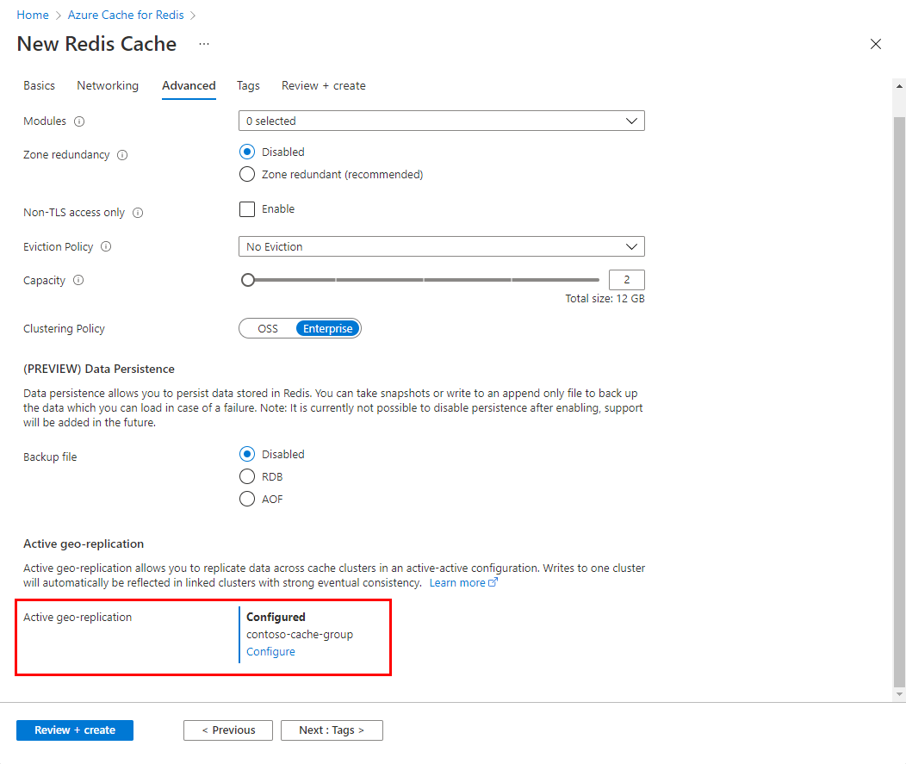
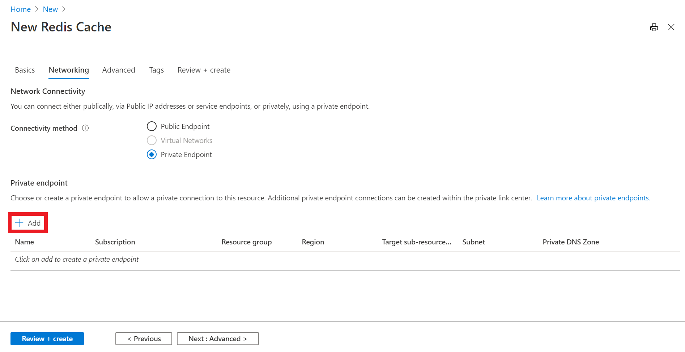
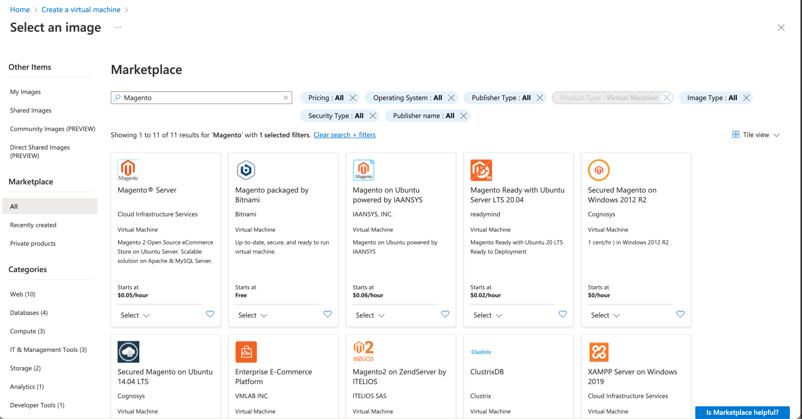

# ACRE Retail Solution

This repo contains utility code for the [ACRE Session Stability Store Solution Brief.](https://www.google.com)
<br>

They are for demonstration purposes and not meant for production.
<br><br>

  
  

## Pre-requisites

Prior to running this retail application, please ensure following pre-requisites are installed and configured.

- [Azure CLI](https://docs.microsoft.com/en-us/cli/azure/install-azure-cli) or [Azure Powershell](https://docs.microsoft.com/en-us/powershell/azure/install-az-ps?view=azps-8.1.0)

- Create a resource group to hold all the infrastructure, if **not** using the ARM Template.
<br><br>

## High Level Workflow

The ARM Template will create all the solution stack for you. In case you want to manually build it, the following is the high level workflow which you will follow:

1. Clone this repo on to your local system
2. Set up a Azure Cache for Redis Enterprise Active Geo Replication on Microsoft Azure
3. Configure Private Links for ACRE
4. Create 2 VMs to host Magento
5. Create a 3 VNets, 1 subnet in each VNet
6. Create a Azure Database for MariaDB used by Magento
7. Create Storage Account for Azure CDN
8. Create Azure CDN Profile and Endpoint
9. Upload Magento pub/media to Azure CDN
10. Create a load balancer for the retail application serving in two Azure regions
11. Access the retail application via the load balancer's endpoint
12. Tear down the environment

<br><br>

### Step by Step

#### 1. Clone this repo

```
git clone https://github.com/Redislabs-Solution-Architects/acre-retail-solution
cd acre-retail-solution
```

#### 2. Set up a Azure Cache for Redis Enterprise Active-Active database on Microsoft Azure

Create an active-active subscription in Azure:
For this setup, you will pick **East US** and **West US** Azure regions as follows:

- When creating a new Azure Cache for Redis resource, select the **Advanced** tab. Complete the first part of the form including **Clustering policy**.

- Select **Configure** to set up **Active geo-replication**
  
  
- Create a new replication group for a first cache instance. Or, select an existing one from the list.



- Select **Configure** to finish.
  
- Wait for the first cache to be create successfully. When complete, you see **Configured** set for **Active geo-replication**. Repeat the aboe steps for each cache instance in the geo-replication group.



#### 3. Configure Private Links

- In the **Networking** tab, select **Private Endpoint** for the connectivity method.

- Select the **Add** button to create your private endpoint.


- On the **Create a private endpoint** page, configure the settings for you private endpoint with the virtual network and subnet you created and select **OK**.

#### 4. Create 2 VMs to host Magento

- In Azure portal's search texbox, enter **virtual machines**.

- Select **Virtual Machiens** under **Services**.

- Select **Create** and then **Virtual Machine** under the **Virtual Machine** mage. The **Create a virtual machine** page opens.

- In the **Basics** tab, under **Project details**, make sure the correct subscription is selected and then choose the Resource group already created or create a new one.

- Under **Instance details**, enter a name for the virtual machine under **Virtual machine name**. If using the ARM template it will create the first VM as **east-magento**.

- Under **Region**, select the region where the first instance will be created. In our case **East US**.

- Under Image, select **See all images**. The **Select an image** window will appear.

  - Enter **Magento** in the **Search** texbox.

  - Pick the select button under the image named **Magento Server** from CLoud Infrastructure Services.



- Select **Review + create** to create the resource.

- Do the same process for the second virtual machine and give it a different name. If using the ARM template it will create the second VM as **west-magento**.

#### 5. Create a 3 VNets, 1 subnet in each VNet

- In Azure portal's search textbox, enter **Virtual Network**. Select **Virtual Network** in the search results.

- Select **Create** in the **Virtual Network** page.

- Fill out the information in the **Create virtual network** page. If using the ARM template it will create 3 Virtual Networks with names (**vnet-east**, **vnet-west**,**vnet-south-central**)

- Select **Review + create** to create the resource.

#### 6. Create a Azure Database for MariaDB used by Magento

- In Azure portal's search textbox, enter **MariaDB**. Select **Azure Database for MariaDB** on the search results.

- Fill out the information in the **Create MariaDB server** page.

#### 7. Create Storage Account for Azure CDN

- In Azure portal's search texbox, enter **Storage**. Select **Storage Accounts** on the search results.

- Select **Create** in the **Storage Accounts** page.

- Fill out the information in the **Create a storage account** page. If using the ARM template it will create it with name (**magentocdnst**).

- Select **Review + create** to create the resource.

#### 8. Create Azure CDN Profile and Endpoint

- In Azure porta's search textbo, enter the name of the storage account create in **Step 7**.

- Select the storage account on the search results.

- Select the **Azure CDN** tab located under the **Security + networking** section, in the left side of the selected storage account.

- At the bottom of the page, fill out the information to create a new endpoint. Select the blob storage as the **Origin hostname**.

- Select **Create** to create the resource.

#### 9. Upload Magento pub/media to Azure CDN

- Download the pub/media files into your local machine:

```bash
#!/bin/bash
scp -r -i ~/.ssh/yourpemkeyname.pem vmusername@vmipaddress:/var/www/html/magento2/pub/media /users/yourusername/Desktop/pub/
```

- Upload the folder **pub/media** into a container inside the storage account created in **Step 8**. If using the ARM template, it will create a container named **magento**.

- Add the link to the pub/media folder into Magento. To do this you can use MySQLWorkbench to access Magento's database or using Magento Admin page.

  - If using MySQLWorkbench open the table **core_config_data** and update the path named **web/unsecure/base_media_url** if using http or **web/secure/base_media_rul** if using https with the URL of the pub/media folder created in the storage account. 

  - After updating the database we need to clear the Magento cache so it loads the new congiguration. We do this by running the commands:

  ```bash
  #!/bin/bash
  cd /var/www/html/magento2
  sudo bin/magento cache:clean
  sudo bin/magento cache:flush 
  ```

#### 10. Create a load balancer for the retail application serving in two Azure regions

- In Azure portal's search textbox, enter **Azure Front Door**. Select **Front Door and CDN profiles** on the search results.

- Select **Custom Create** and then the **Continue to create a Front Door** button in the **Compare offerings** page.

- Fill out the information in the **Create a front door profile** page.

  - Add an endpoint name
  
  - Go to the **Endpoint** tab and select **Add an endpoint** button.

    - Enter and endpoint name and select the **Add** button.
  
    - Select **Review and Create**.

  - In Azure portal, go the the newly created Azure Front Door resource.

  - In **Settings** select **Front Door manager**.
    - Select the **Add a route** button.

      - Enter the route name.

      - Select the domain(s).

      - Select the accepted protocols.

      - Select the **Add a new origin group**.

        - In the **Add an origin group** page:

          - Enter the name.

          - Select **Add an origin** button.

            - Enter a **Name** for the origin

            - Enter an origin type. In our case we select **Custom** to add the IP Address for the Virtual Machines that we created in Step 4.

            - Enter the **Host name**. This will be the IP Address of the Virtual Machine.

            - Enter the **Origin host header**. This needs to match with the one provided in the Apache configuration inside the Virtual Machine hosting magento.

            - Enter **Priority** 1.

            - Enter **Weight** 100.

            - When finished, select the **Add** button.

            - Repeat the process of adding an origin group for the process for the next Virtual Machine.

        - If enabling health probes, enter the **Path**, **Protocol**, **Probe method** and **Interval**.

        - Enter the **Sample size**, **Required samples** and **Latency sesitivity**.

        - When gfinished, select the **Add** button.

#### 11. Access the retail application via the load balancer's endpoint

#### 12. Tear down the environment

